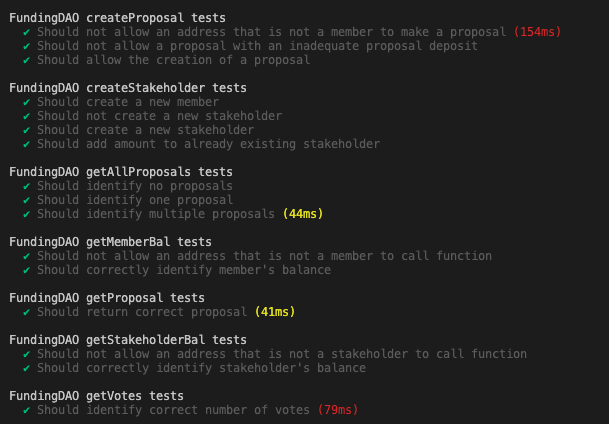
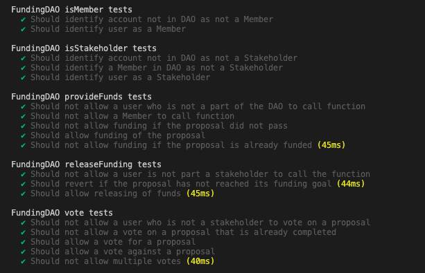
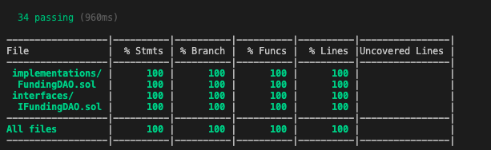
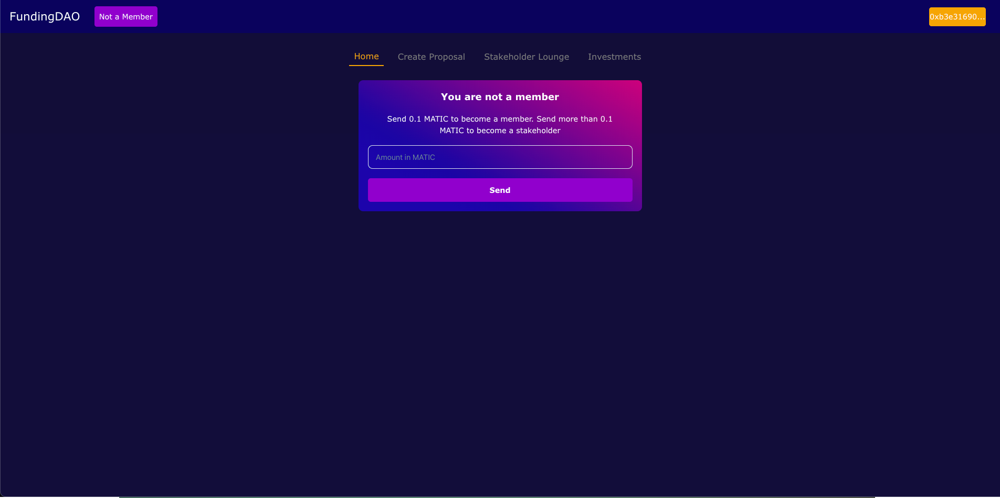
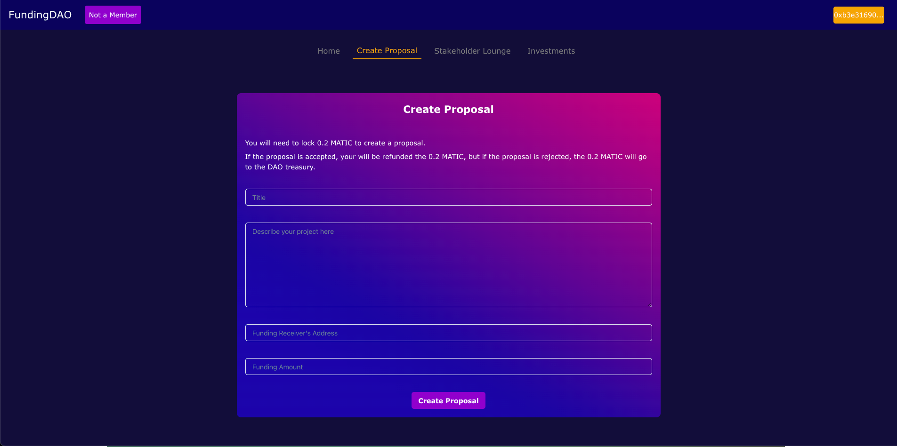
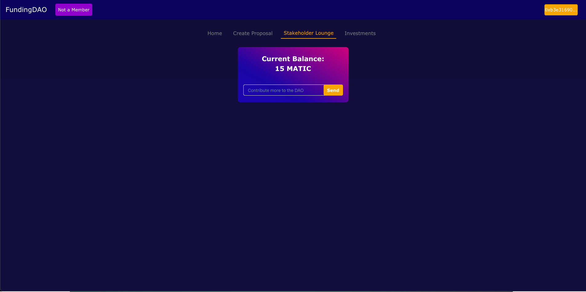
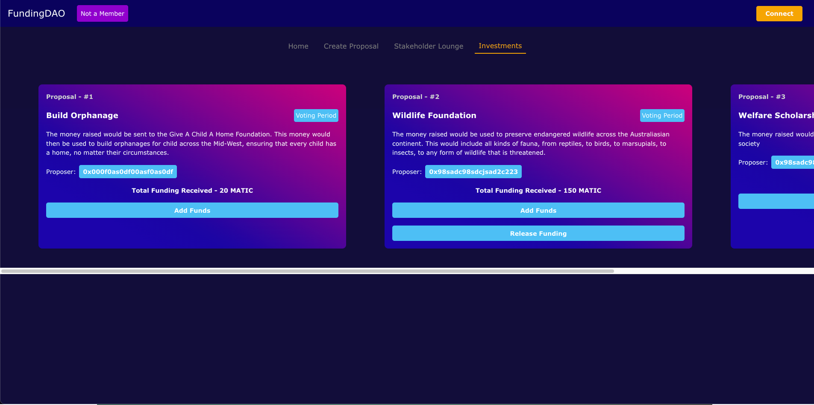
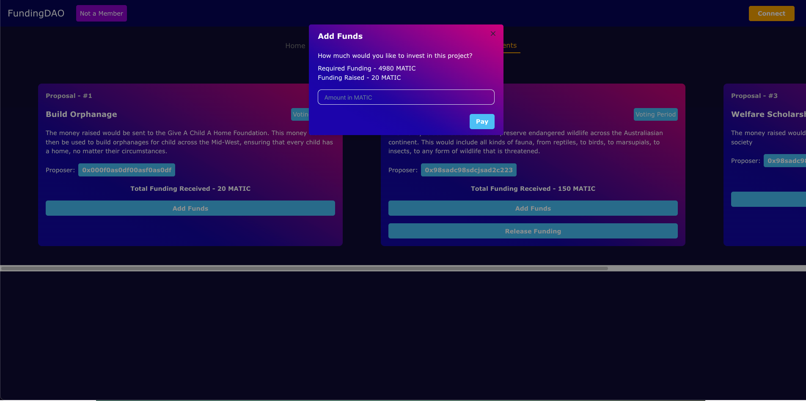
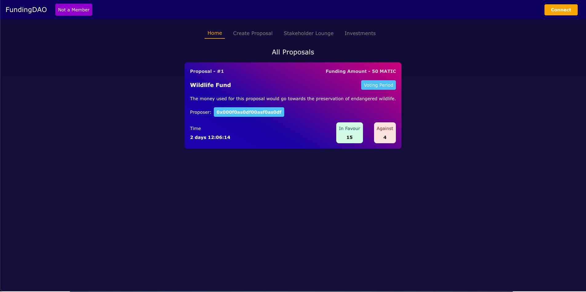
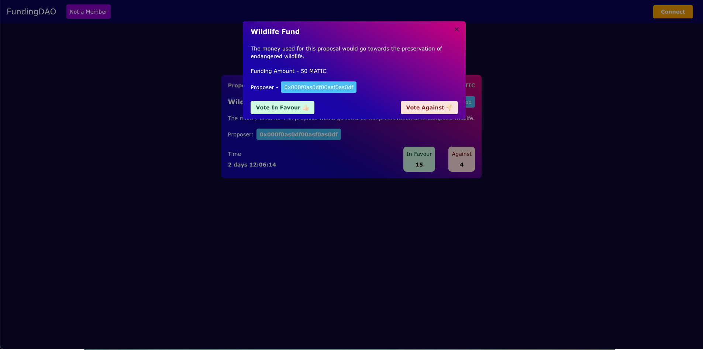

<h1>FundingDAO</h1>

- This project is a [DAO](https://ethereum.org/en/dao/), that allows users to become either Members or Stakeholders, and therefore make proposals which can be fundraised through the DAO, by sending Polygon Mumbai Matic to the contract
- Adapted from [this tutorial](https://learn.figment.io/tutorials/funding-dao-polygon) by [Viral Sangani](https://github.com/viral-sangani)
- Built using [NextJS](https://nextjs.org/), [Chakra UI](https://chakra-ui.com/), [Hardhat](https://hardhat.org/), and [Solidity 0.8.17](https://docs.soliditylang.org/)
- NOTE: This project is a proof of concept, and not intended to represent a polished Web3 game. The contract used in this application has not been audited, and I take no responsiblity for issues which may arise out of its extended use.

## Deployed Contract (Mumbai Polyscan)
[FundingDao](https://polygonscan.com/address/0x876Fe1F4F09908BE93D31eB6be113Be72cb70b48)

## Test Coverage

## Screenshots

### Home Page

### Create Proposal

### Stakeholder Lounge

### Investments

### Add Funds Modal

### All Proposals

### Vote Modal

